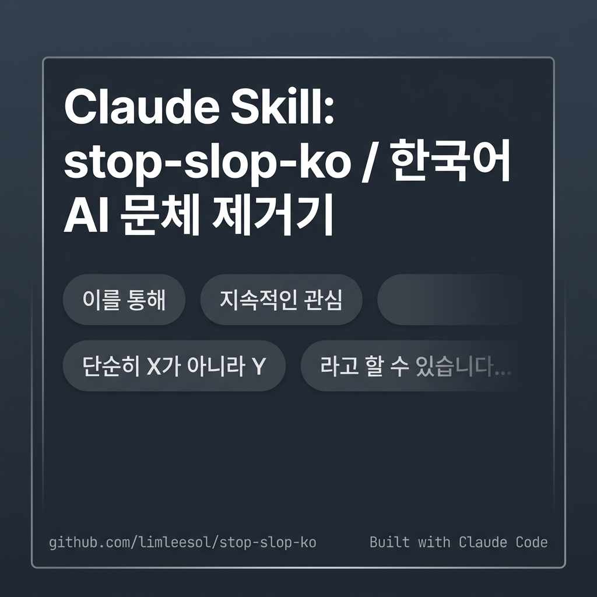

# stop-slop-ko: 한국어 AI 문체(slop) 제거기

한국어 글에서 AI 문체를 제거하는 Claude 스킬.

*(English Summary: A Claude skill designed to eliminate AI-generated writing style ("AI slop") from Korean prose. For a detailed summary, see the [English Summary](#english-summary) at the bottom.)*

---

## 배경

한국어 LLM 출력에는 영어에 없는 패턴이 있다. 이중피동(`보여지다`), 번역투(`~를 통해`, `~에 의해`), 단정 회피 어미(`~라고 할 수 있습니다`), 양비론 반사(`물론 ~한 측면도 있지만`). [stop-slop](https://github.com/hardikpandya/stop-slop)의 한국어 버전이 없어서 만들었다.

---

## 범위

목표는 AI 문체 제거다. 문법 교정이 아니다. 문법이 완벽해도 slop일 수 있다. 핵심 규칙은 slop에 집중하고, 이중피동·번역투 같은 규범 문제는 부록으로 분리했다.

두 가지 모드로 작동한다. **교정 모드**는 이미 쓰인 글에서 slop을 지우고, **생성 모드**는 한국어 산문을 새로 쓸 때 같은 패턴을 애초에 쓰지 않는다. slop은 고치는 것보다 안 만드는 쪽이 싸다.

패턴 표기:
- **[규범]** — 국립국어원 규범으로 확인 가능한 것
- **[관찰]** — LLM 출력에서 Claude가 반복 분류한 패턴

---

## 주요 패턴

- **말하기**: 서론 선언, 단정 회피 어미, 공허한 결론, 메타 강조
- **구체성**: 사물 주어, 공허한 수식어, 과장 형용사, 막연한 권위 호소
- **구조/리듬**: 접속사 남발, 이분법·양비론 대조, 동어반복, 메타담화, 번호 열거, 단락 리듬, 줄표 남용, 불릿 나열 의존
- **과교정 방지**: 문장을 모두 짧은 단정문으로만 바꾸면 그 자체가 새로운 slop이 된다. 핵심은 다양성이다.

---

## 핵심 규칙

교정은 삭제이지 창작이 아니다. 공허한 표현만 지우고, 원문의 사실·수치·논점은 건드리지 않는다. 추상어를 구체어로 바꿀 때 원문에 근거가 없으면 삭제만 한다 — 사실을 지어내지 않는다.

---

## 사용법

- **Claude Code:** `skills/` 폴더 안에 이 폴더를 넣는다.
- **Claude Cowork:** `.skill` 파일을 다운받아 설치한다.
- **스킬 없이:** `SKILL.md` 전체를 프롬프트에 붙여 넣는다.

---

## 검증 및 한계

테스트 케이스 5개를 Claude로 설계하고 실행했다. 각 케이스는 스킬 적용(with)과 미적용(without) 결과를 어설션 기반으로 비교한다. 세부 평가 데이터셋은 [`evals/evals.json`](evals/evals.json), 발동 데이터셋은 [`evals/trigger_eval.json`](evals/trigger_eval.json)에서 볼 수 있다.

| 케이스 | 테스트 항목 | with | without |
|---|---|---|---|
| 보고서 slop | 서론 선언·단정회피·접속부사·공허한 결론 | 6/6 | 5/6 |
| 칼럼 slop | 양비론·이분법·사물주어·막연한 권위·AI 클리셰 | 6/6 | 6/6 |
| 수치 보존 | slop 제거 + 원문 수치 무손실 | 6/6 | 6/6 |
| 과교정 함정 | 에세이 리듬·감정 어휘 보존 | 5/5 | 5/5 |
| 레지스터 유지 | 격식체 유지 + AI 클리셰 제거 | 6/6 | 5/6 |
| **합계** | | **100%** | **93.1%** |

### 분석 및 한계
- **자기참조 구조**: Claude가 생성한 결과물을 Claude가 직접 채점했다. 채점자가 지향하는 교정 방향을 이미 아는 상태에서 평가했기에 점수 차이(Δ = +6.9pt)가 작고 두 버전 모두 높은 점수가 기록되었다.
- **실제 기여점**: 정량 지표상의 격차는 작지만, 실제 사용 시 (1) 글의 흐름을 해치는 과교정 방지, (2) '시사점 제공' 같은 한국어 AI 상투어 제거 등 미묘한 디테일에서 유의미한 차이를 만든다.

---

## 참고

이 프로젝트는 Hardik Pandya의 [stop-slop](https://github.com/hardikpandya/stop-slop)에서 영감을 받아 시작되었다. 영어와 다른 한국어 LLM 답변의 어색한 반복 패턴들을 Claude로 수집·정리했다. 규범 조사는 국립국어원 자료를 참고했다.

---

## 기여 및 제보

실제 사용 중 발견되는 아래의 문제들은 **GitHub Issues**나 **Pull Requests**로 제보 바란다.

* 문맥이 왜곡되거나 원본 정보가 유실되는 **과교정(Overcorrection) 사례**
* AI가 썼음이 명백함에도 스킬이 잡아내지 못하고 넘어가는 **신규 slop 패턴 및 상투어**
* 프롬프트 효율성을 높이기 위한 개선 아이디어

## 저자

Lim Leesol ([@limleesol](https://github.com/limleesol))

---

## 라이선스

MIT — [LICENSE](LICENSE)

---

## English Summary

`stop-slop-ko` is a Claude Skill (packaged prompt guideline) designed to eliminate AI-generated writing style (often referred to as "AI slop") from Korean prose. 

While the original [stop-slop](https://github.com/hardikpandya/stop-slop) by Hardik Pandya focuses on English writing, this repository addresses unique Korean LLM artifacts, such as double passives, English-to-Korean translationese particles, excessive hedging/vagueness, and artificial politeness.

### Core Goals
- **De-slop Korean LLM Output**: Detect and remove typical AI clichés and awkward stylistic traits observed in Korean LLM responses.
- **Strict Information Preservation**: Ensure that editing is strictly subtractive (removing slop phrases) without altering the source text's facts, figures, or arguments. No details are fabricated.

### Methodology & Evaluation
- **AI-Assisted Curation**: Leveraging Claude's capabilities, we collected, classified, and organized repetitive patterns of stylistic defects from various Korean LLM outputs.
- **Benchmark & Testing**: Evaluated using trigger and quality datasets to verify the prompt's stability.
  - **Trigger Accuracy**: Tested query classification models using a dataset of trigger/no-trigger scenarios ([evals/trigger_eval.json](evals/trigger_eval.json)).
  - **Output Quality & Preservation**: Evaluated quality using structured test cases and assertion-based grading ([evals/evals.json](evals/evals.json)).
- **Limitations**: The evaluation is self-referential, as the outputs generated by Claude were graded by Claude itself. Despite this constraint, the tests were conducted systematically to establish baseline reliability.
